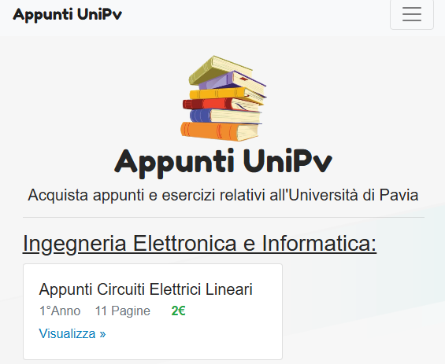
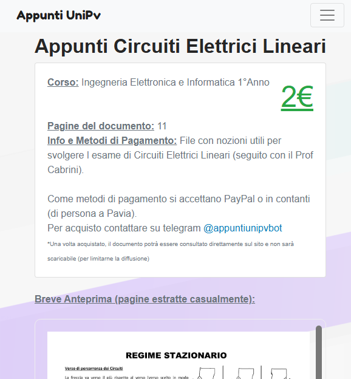

# Appunti Unipv

Personal project. Web platform to share and/or sell school notes securely.

### Features:
- Authentication and role management
- Upload and approval of notes by the staff
- Anti-download and screenshots protection

<h3> Warning:</h3>
This repository used to be private, so it contains some sensitive information such as tokens or passwords. Don't worry, they are all currently obsolete

### Demo Screenshots:
- 
- 

